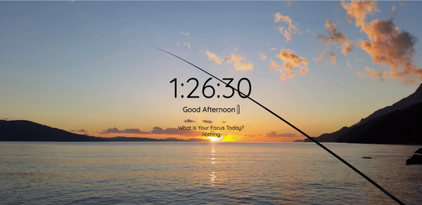

<p align="center">
<a href="https://www.linkedin.com/in/ahmet-ayd%C4%B1n-2583b1199/" target="_blank"></a>
</p>


# Dynamic Landing Page


## Table of contents

- [Overview](#overview)
  - [The challenge](#the-challenge)
  - [Screenshot](#screenshot)
  - [Links](#links)
  - [Skeleton](#skeleton)
- [My process](#my-process)
  - [Built with](#built-with)
  - [What I learned](#what-i-learned)
  - [Continued development](#continued-development)
  - [Useful resources](#useful-resources)
- [Author](#author)


## Overview

### The challenge

Users should be able to:

- View the optimal layout for the site depending on their device's screen size
- See hover states for all interactive elements on the page

### Screenshot

<p align="center">
<a href="https://bavi-boop.github.io/dynamic-landing-page/"></a>
</p>


### Links

- [live site URL here: ([Live Website)](https://bavi-boop.github.io/dynamic-landing-page/)

## Project Skeleton 

```
parallax-website(folder)

|----README.md                   
|----images      
     | photos...
|----index.html  
|----style.css   
|--- script.js
|----images
```

## My process

### Built with
- JS DOM
- JS Functions
- Semantic HTML5 markup
- CSS custom properties
- Flexbox
- CSS Grid
- Mobile-first workflow

- [Styled Components](https://styled-components.com/) - For styles


### What I learned

I learned how to use Javascript DOM Manipulation, flexboxes, media queries, html elements and many more.

To see how you can add code snippets, see below:

```html
<h1>Some HTML code I'm proud of</h1>
```
```css
.proud-of-this-css {
  @media only screen and (min-width: 790px) {
}
```
```js
        if(e.which ==13 || e.keyCode == 13) {
            localStorage.setItem("names", e.target.innerText);
            names.blur();
        }else {
            localStorage.setItem("names", e.target.innerText);
        }
}
```


### Continued development

I will build backend and extra pages for this website in the future.

**Note: Delete this note and the content within this section and replace with your own plans for continued development.**

### Useful resources

- [W3 Schoold](https://www.w3schools.com/) - This helped me for basics of website paradigm. I really liked this pattern and will use it going forward.
- [MDN](https://developer.mozilla.org/en-US/) - This is an amazing document which helped me finally understand deep sides of web development. I'd recommend it to anyone still learning these concepts.
- [Tutorial](https://www.youtube.com/watch?v=fSTQzlprGLI) - This helped me to complete the project. You can have a look at the tutorial

## Author

- Author - [Ahmet]
